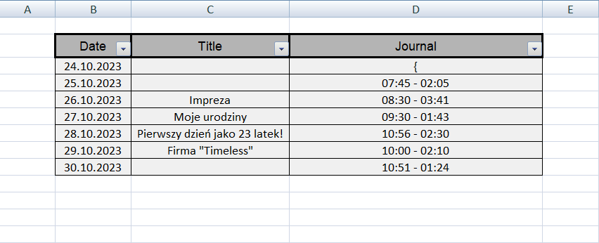

# Excel-Diary-Maker
Program in Python which make excel diary from your notes and update them with new ones by adding them at the end. 
Notes have format:  
  - "Day" Date Title 
  - (body) 
  - "Day" Date Title 
  - (body) 
  
Program use openpyxl from Python

