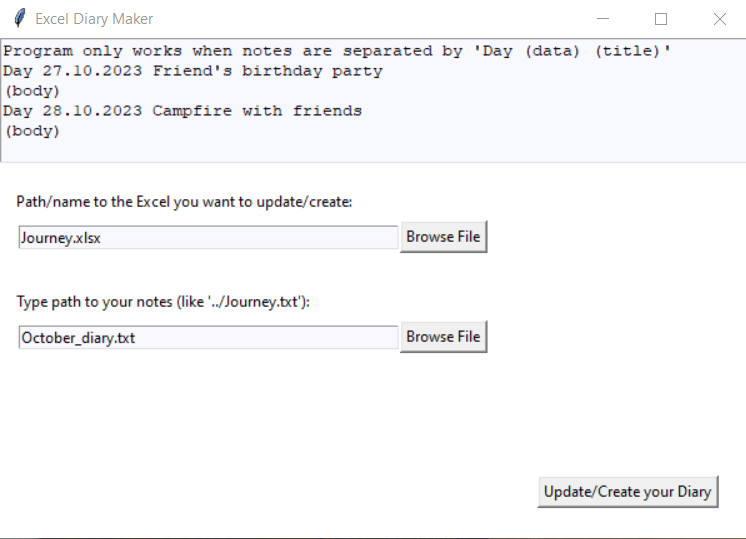

# Excel-Diary-Maker
<h3>To use app just download file Excel-Diary_Maker.exe</h3>

❗❗ This is not a professional program, so be sure to make a copy before updating your journal! Just in case if something unexpected would destroy diary.

Program in Python which make excel diary from your notes 
and update them with new ones by adding them at the end. 

Notes have format:
  - "Day" Date Title 
  - (body) 
  - "Day" Date Title 
  - (body) 
  
Program use openpyxl from Python

